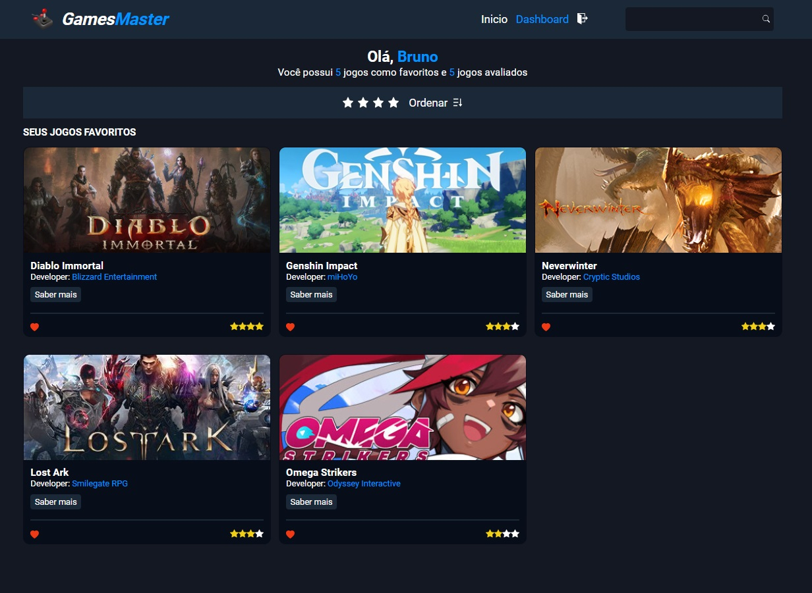

# 🏆 Games Master Website




<br>

## 📎 Sumario 

- 📌 Resumo do Projeto
- 🛠️ Como executar o projeto
- ⭐ Features 
- 📂 Temas abordados 
- 🚀 Exemplos de código
- ✔️ Tecnologias Utilizadas 
- 🙋🏻‍♂️ Autor
- 💻 Licença

<br>

## 📌 Resumo do Projeto
Este projeto é um aplicativo de catálogo de jogos criado com React. Ele permite que os usuários naveguem por uma lista de jogos e filtrem os resultados por gênero ou título. O aplicativo foi construído usando técnicas modernas de desenvolvimento web, incluindo o uso do Context API para gerenciamento de estado e hooks personalizados para separação de lógica. A estilização foi feita com SASS, utilizando variáveis e mixins para manter o código limpo e modular.

<br>

## 🛠️ Como executar o projeto
Para executar este projeto localmente em sua máquina, siga estas etapas:

- Certifique-se de ter o Node.js instalado em sua máquina.

- Clone este repositório em sua máquina local usando o comando ``git clone``.

- Navegue até a pasta do projeto clonado e execute o comando ``npm install`` para instalar todas as dependências necessárias.

- Execute o comando ``npm run dev`` para iniciar o servidor de desenvolvimento local.

- O projeto estará rodando na url: http://localhost:5173/


<br>

## ⭐ Features
- Navegação por gênero: os usuários podem filtrar a lista de jogos por gênero usando a barra lateral.
- Busca por título: os usuários podem pesquisar jogos pelo título usando a barra de pesquisa no cabeçalho.
- Gerenciamento de estado com Context API: o aplicativo usa o Context API para compartilhar valores entre componentes e gerenciar o estado global.
- Hooks personalizados: o aplicativo usa hooks personalizados para separar a lógica de busca de dados e tornar o código mais modular e reutilizável.
- Estilização com SASS: o aplicativo usa SASS para estilização, aproveitando recursos como variáveis e mixins para manter o código limpo e modular.

### Novidades

- Os usuários podem agora criar uma conta com email e senha e logar no site, está autenticação é feita através do firebase.

- Os usuários agora podem selecionar seu jogos favoritos e avaliar com uma nota de 1 a 4, todo esse armazenamento é feito pelo firestore.

- Os usuários agora podem filtrar seus jogos por favoritos, ordem de avaliação ou valor absoluto de avaliação.

- Os usuários agora podem visualizar uma página personalizada sua, onde poderam ver apenas seus jogos favoritos e avaliados.

- O site agora possui uma página de erro 404, para quando digitar o caminho errado, informando que aquele local não existe.

- O site agora oferece suporte para seleção de temas claro e escuro (por padrão vem no tema escuro)

- O site agora oferece um botão de sroll para o topo da página a medida que os usuários vão navegando pelo site, melhorando a experência do usuário.

- O site agora oferece em modo mobile um menu hamburguer para melhor experiência e foi modificada a barra de seleção de genêros para melhor visualização dos usuários.

- O site agora possui algumas animações nos cards a medida que os mesmos vão se posicionando ou sendo filtrados, oferecendo uma experiência melhor para o usuário.

- Os cards de jogos agora contam com informações adicionais como o nome da desenvolvedora e um botão para navegar para a página do jogo com informações mais detalhadas.

<br>

## 📂 Temas abordados
- React: O projeto foi construído usando a biblioteca React para criar uma interface de usuário interativa.

- Context API: O projeto usa o Context API do React para gerenciar o estado global e compartilhar valores entre componentes.

- Hooks: O projeto usa hooks do React, incluindo useState, useEffect e useContext, bem como hooks personalizados para separar a lógica de busca de dados.

- Axios: O projeto usa a biblioteca Axios para fazer requisições HTTP e buscar dados de uma API externa. A função fetchData usa o Axios para enviar uma requisição GET para a API e retornar os dados recebidos. A função também inclui tratamento de erros para lidar com possíveis falhas na requisição.

- SASS: O projeto usa SASS para estilização, aproveitando recursos como variáveis e mixins para manter o código limpo e modular.

### Novidades
- Firebase: Ele é uma plataforma de desenvolvimento de aplicativos móveis e web do Google que fornece uma variedade de ferramentas e serviços para ajudar os desenvolvedores a criar, desenvolver e expandir seus aplicativos. Ele inclui recursos como autenticação, banco de dados, armazenamento, hospedagem e análises.

- Firebase Authentication: É um serviço do Google que permite autenticar usuários em seu aplicativo usando vários provedores de identidade, como e-mail/senha, Google, Facebook, entre outros. É fácil de usar e integrar em seu aplicativo.

- Cloud Firestore: É um banco de dados NoSQL flexível e escalonável para desenvolvimento de aplicativos móveis, web e de servidor do Firebase e do Google Cloud. Ele permite armazenar, sincronizar e consultar facilmente dados em escala global.

<br>

## 🚀 Exemplos de código
Aqui estão alguns exemplos de trechos de código que ilustram como algumas das principais features do projeto foram implementadas:

### Gerenciamento de estado com Context API
Este trecho de código mostra como o Context API foi usado para gerenciar o estado global e compartilhar valores entre componentes:
```
import React, { createContext, useContext, useState } from 'react'

const AppContext = createContext()

export const AppProvider = ({ children }) => {
  const [search, setSearch] = useState('')
  const [selectedGenre, setSelectedGenre] = useState(null)
  const [genres, setGenres] = useState([])

  const value = {
    search,
    setSearch,
    selectedGenre,
    setSelectedGenre,
    genres,
    setGenres
  }

  return <AppContext.Provider value={value}>{children}</AppContext.Provider>
}

export const useAppContext = () => useContext(AppContext)
```

### Hooks personalizados
Este trecho de código mostra como um hook personalizado foi criado para separar a lógica de busca de dados e tornar o código mais modular e reutilizável:
```
import { useState, useEffect } from 'react'
import { fetchData } from 'data/data'

const useFetchData = () => {
  const [data, setData] = useState(null)
  const [loading, setLoading] = useState(false)
  const [error, setError] = useState(null)

  useEffect(() => {
    setLoading(true)
    fetchData()
      .then((data) => {
        setData(data)
        setLoading(false)
      })
      .catch((error) => {
        setError(error.message)
        setLoading(false)
      })
  }, [])

  return { data, loading, error }
}

export default useFetchData
```

### Mixins
O projeto usa mixins SASS para reutilizar blocos de código em vários lugares. Aqui está um exemplo de como os mixins são definidos e usados:
```
// Arquivo mixins.scss
@mixin display-between($position, $align) {
  display: flex;
  flex-direction: $position;
  justify-content: space-between;
  align-items: $align;
}

// Arquivo mainContent.scss
@use 'styles/mixins';

.main {
  @include mixins.display-between(row, start);
}
```

<br>

## ✔️ Tecnologias Utilizadas


<br>

## 🙋🏻‍♂️ Autor

| [<br><sub>Bruno Oliveira</sub>](https://github.com/BrunoOliveira16) |
| :---: |

<br>

## 💻 Licença
Este projeto está licenciado sob a licença MIT. Isso significa que você pode usar, copiar, modificar e distribuir o código-fonte deste projeto para qualquer finalidade, desde que inclua uma cópia da licença em todas as cópias ou partes substanciais do software.

Para obter mais informações sobre a licença MIT, consulte o <a href="https://opensource.org/license/mit/">texto completo da licença.</a>